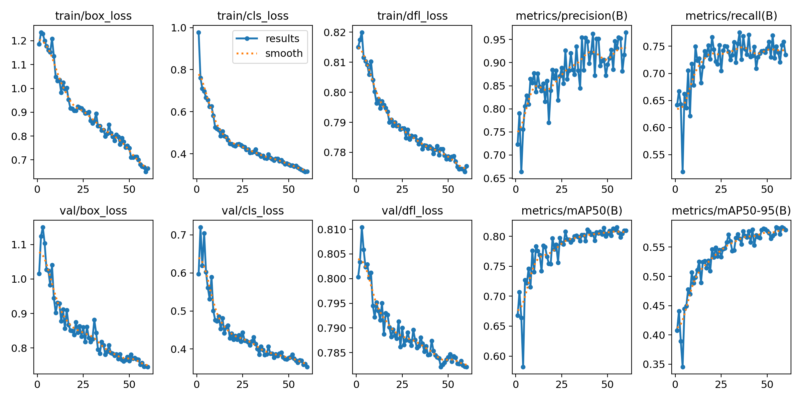

# Sports Video Analysis and Tracking System

This project implements an end-to-end computer vision pipeline for analyzing sports videos using YOLOv8 and object tracking. It detects players, referees, and the ball; estimates camera movement; assigns teams; estimates player speed and ball possession; and generates a visually annotated output video.

---

## 🧠 Features

- **YOLOv8 Object Detection** – Detect players, referees, and the ball using a pretrained custom model.
- **ByteTrack Multi-object Tracking** – Reliable tracking over time for multiple classes.
- **Camera Motion Estimation** – Corrects tracked positions with motion compensation.
- **View Transformation** – Transforms positions for tactical field-level visualization.
- **Player Speed and Distance Estimation**
- **Team Classification Based on Jersey Colors**
- **Ball Possession Detection**
- **Annotated Video Output with Visual Overlays**

---
## input video: 
https://drive.google.com/file/d/1HXFTdSIFYOGLVDKlwv_UYGKZ3-NwIG2G/view

## Trained model: 
https://drive.google.com/file/d/1S2zfdgDEo7Vi8OSIP9Krz3gXvXO1JJ_c/view

---
```bash
pip install ultralytics supervision opencv-python numpy pandas
```
- Install the necessary libraries
---

--upgrade: Ensures you get the latest compatible versions.
---

## 🚀 Usage

### A. Run YOLO Inference (Only Object Detection)

```bash
python yolo_inference.py
```

- Loads `models/best.pt`
- Detects objects in `input_videos/08fd33_4.mp4`
- Saves results with bounding boxes

---

### B. Run Full Analysis Pipeline

```bash
python main.py
```

The pipeline performs:

1. Read input video
2. Track players, ball, and referees
3. Estimate camera motion and adjust positions
4. Apply view transformation
5. Interpolate ball positions
6. Estimate speed and distance of players
7. Assign team based on color
8. Assign ball possession
9. Annotate frames with bounding boxes, speed, team, and ball control
10. Save final output to `output_videos/output_video.avi`

---

## 📊 Model Training Results

The YOLO model was trained on a custom football dataset for detecting:
- Ball
- Player
- Goalkeeper
- Referee

### Training Curves

<p align="center">
  
</p>

### Final Performance Metrics

| Metric | Value |
|-------|------|
| Precision | 0.95 |
| Recall | 0.75 |
| mAP@50 | 0.81 |
| mAP@50-95 | 0.58 |


## 🧰 Developer Notes

- The YOLO model is loaded using:  
  ```python
  from ultralytics import YOLO
  model = YOLO('models/best.pt')
  ```

- Ball possession is visualized using a triangle over the player bounding box.

- Team assignment is color-based using the frame's pixel values.

- Player and ball annotations are stored frame-by-frame in a nested dictionary structure.

- Intermediate data can be cached using `stubs/` to avoid recomputation:
  - `track_stubs.pkl`: Cached object tracks
  - `camera_movement_stub.pkl`: Cached camera movement

---

## 📦 Output

After successful execution of `main.py`, the processed video with annotations will be saved in:

```
output_videos/output_video.avi
```

This video includes:

- Team-colored player IDs
- Referees in yellow
- Ball markers
- Ball control percentage overlay

---

## 🛠 Dependencies Summary

| Package         | Use                                     |
|----------------|------------------------------------------|
| ultralytics     | YOLOv8 detection                        |
| supervision     | ByteTrack integration                   |
| opencv-python   | Video frame operations and drawing      |
| numpy           | Data handling and manipulation          |
| pandas          | Ball interpolation and tracking data    |

---
